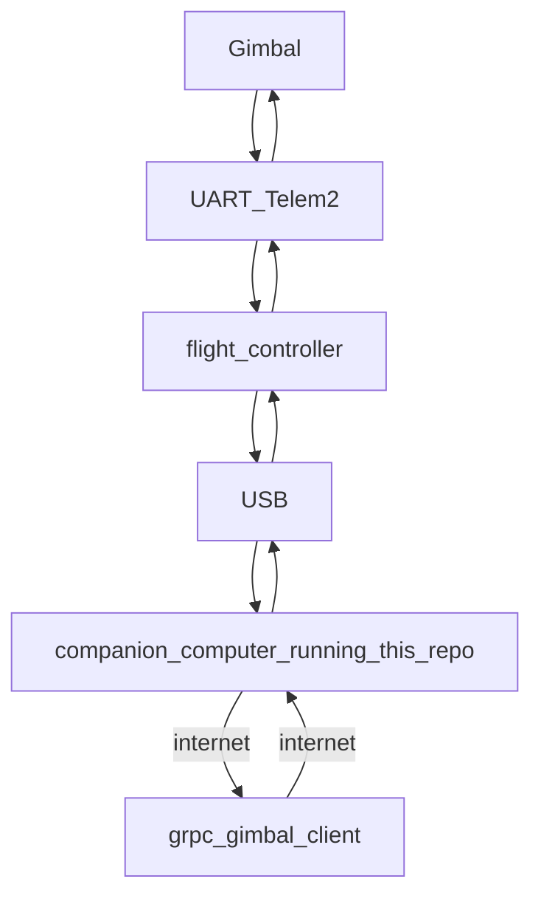

# Mavsdk Gimbal Service Implementation

```mermaid
graph TD;
    Gimbal-->UART_Telem2;
    UART_Telem2-->Gimbal;
    UART_Telem2-->flight_controller;
    flight_controller-->UART_Telem2;
    flight_controller-->USB;
    USB-->flight_controller;
    USB-->companion_computer_running_this_repo;
    companion_computer_running_this_repo-->USB;
    grpc_gimbal_client--internet-->companion_computer_running_this_repo;
    companion_computer_running_this_repo--internet-->grpc_gimbal_client;
```